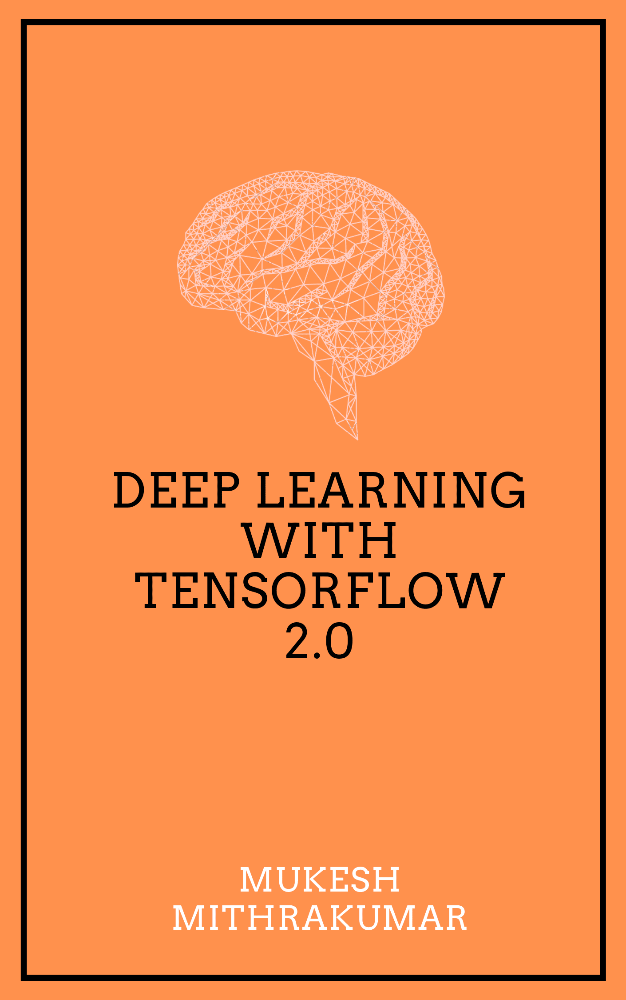

Hi 😃, I'm Mukesh, Welcome to my Blog ❤️.

My background is in Electrical Engineering and Physics and I started my machine learning journey 4 years back as an undergraduate researcher and taught myself everything I know with the help of online resources, few great mentors and great projects from work. And now, I consult for startups and a few big companies and I mentor learners like you.

From my time mentoring students from a wide range of background, I found three major groups who lack the necessary resources and I write this blog for you all:

1. Students looking to get a deeper understanding of Artificial Intelligence principles. I would highly recommend starting from [What it means to have Artificial Intelligence](https://www.adhiraiyan.org/ai/what-it-means-to-have-ai) so we are on the same page.

2. Data Scientists working in the industry looking to learn about best Machine Learning practices and tools to make their work easy.

3. Business professionals looking to learn about the value AI can bring to your business.

My mission is to build a platform for you where you can come to learn about Everything related to Artificial Intelligence.

To get notified when I post new content you can Follow me on:

<a href="https://www.facebook.com/adhiraiyan/">
        

You can also [Subscribe](https://www.adhiraiyan.org/) to get the email updates to your inbox. Trust me, I hate spam just as much as you do 😉.

New content will be posted every Tuesday at 11am EST | 3pm UTC time 🕙.

The posts will be in Question and Answer format to be able to be searchable so if you need to review something quick, you will be able to search for only that using the [Posts Search](https://www.adhiraiyan.org/search.html).

If you like my Blog, you might also like my FREE book on [Deep Learning with Tensorflow 2.0](https://www.adhiraiyan.org/DeepLearningWithTensorflow.html).

If you find the content I am putting out useful, consider supporting my work by:

